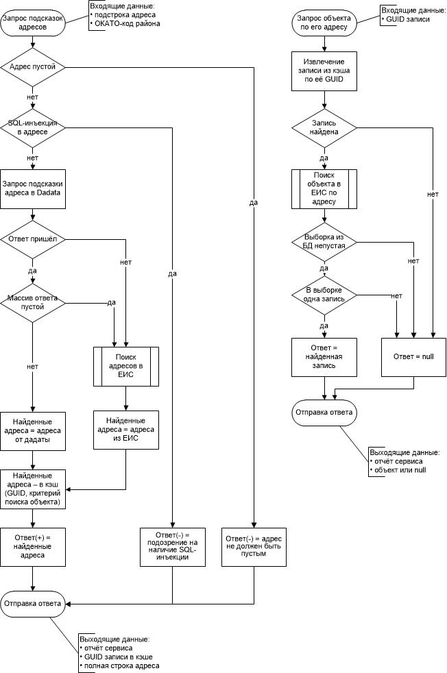

upd 12.03.2018

# Веб-сервис GuionRest
___

# Общие сведения

## Назначение
Предоставляет REST JSON API для получения сведений из ЕИС, необходимых для тарификации услуг онлайн-услугой "Архивные сведений ПИБ" на сайте и клиентом 1С 8 "Название конфы", спользуемым на Предприятии.

## Настройка
Настройка осуществляется редактированием файла `Web.config` при помощи любого текстового редактора. После внесения изменений в файл необходимость перезапуска сервиса через [IIS Manager](# "Диспетчер служб IIS") не выявлена – настройки применяются сразу. Настраиваемые опции:
 - *логин и пароль пользователя СУБД*, под которым приложение подключается к базам данных (юзер должен быть одинаковым во всех базах);
 - *максимальное количество записей*, которые могут быть выбраны из базы данных поисковым запросом по адресу объекта;
 - *адрес внутреннего сервиса-посредника, подсказывающего адреса*;
 - *строки подключения* к базам данных и перечень районов СПб, «покрываемых» базами. При появлении нового района/базы следует добавить одну строчку в соответствующий раздел файла `Web.config`. При желании исключить одну из баз – удалить или закомментировать соответствующую строчку – это приведёт и к невозможности обращения приложения к базе, и к исключению соответствующего района из списка возвращаемых методом `GetSpbDistricts`.

 После подключения сервиса, в IIS следует произвести для него настройку согласно приведённому изображению:

**ВАЖНО!** Для корректной работы библиотеки Oracle MDAC (см. раздел "Дополнительно") IIS должен работать в разрядности x64, т.к. библиотека рассчитана именно на 64-разрядный режим. IIS для этого настраивается так:

Следует учесть, что IIS может работать только в каком-то одном режиме. По умолчанию (если 32-разрядные приложения разрешены) работают только код и библиотеки, ориентированные на 32-разрядный режим. После приведённой настройки будут работать только ориентированные на x64. Универсальные библиотеки и код (те, которые не зависят от разрядности) будут одинаково хорошо работать в обоих режимах IIS.

Соответственно, чтобы переключить IIS в 64-разрядный режим, ОС Windows должна быть 64-разрядной.

## Потребляет
Данным сервисом потребляются:

1. Внутренний веб-сервис подсказок адреса `Suggestions` – для исправления и структуризации адреса и получения вариантов полного адреса по его подстроке. Этот сервис не является обязательным – без него тоже будет работать, но менее «разборчиво».
2. Все базы данных ЕИС – для получения выборки объектов по адресу.

## Потребители
Данный сервис потребляется:
1. Сайтом Предприятия – для расчёта стоимости заказываемых посетителями сайта услуг. Для взаимодействия с сайтом и разрабатывался сервис.
2. Клиент 1С 8 "Название конфы".
3. *Есть идея, кажущаяся хорошей: реализовать автоматический расчёт стоимости и в 1С для Клиентских Центров ПИБов - им приходится "глазками" и "ручками" извлекать из ЕИС сведения, необходимые дял выставления счётов посетителям.*

## Безопасность
Для обеспечения защиты от **SQL-инъекций** реализованы следующие степени защиты:
1. Значения, должные попасть в текст запроса, проверяются на наличие ключевых SQL-инструкций (update, delete, union, insert, drop, create, procedure, declare). В случае обнаружения таковых, сервис, не обращаясь к базе данных, возвращает потребителю сообщение о подозрительных действиях.
2. Для обращения к базам данных, вместо прямой подстановки параметров в запрос, используется параметризация, в процессе которой СУБД Oracle своими встроенными средствами безопасности и валидации проверяет полученные параметры и, в случае непрохождения проверки, возвращает ошибку (сервис также вернёт ошибку, «услышав» о ней от Oracle).
3. Для ограничения состава возвращаемых данных созданы отдельные C#-классы, жёстко определяющие такой состав (см. каталог `GuionRest\Areas\EisServices\Models\`).
4. Для подключения к базам данных в них (базах) был создан отдельный пользователь (его имя - `web_data`), имеющий права только на чтение. От его имени и происходит подключение.

Для повышения **общей безопасности** сервиса и сервера осуществлена подмена http-заголовков ответа, чтобы клиент "думал", что сервис реализован на php5 и хостится под Apache2. Признаки NET framework и IIS скрыты из http-заголовков.

## Дополнительно
Для работы приложения на сервере IIS должен быть установлен [NET Framework 4.5](https://www.microsoft.com/ru-Ru/download/details.aspx?id=30653).

Приложение не требует наличия установленного клиента Oracle на сервере IIS, т.к. использует библиотеку [Oracle Managed Data Access Client v4.122.1.0](http://www.oracle.com/us/solutions/index-090165.html). По причине неиспользования клиента, обращения приложения к БД не трассируются.

Код района используется для поиска строки подключения к БД нужного района и не участвует в тексте запроса к БД. Подробнее смотри в файле `GuionRest\Web.config`

## Автор
Наумкин Кирилл Леонидович, руководитель проектов развития прикладного программного обеспечения, Служба информационных технологий ГУП ГУПИОН.

телефон, naumkin.kl@mail.ru, служ.почта
___

# API веб-сервиса

## Шаблон ответа
В общем виде ответ от сервиса выглядит так:

    {
      "svcRpt":         // Отчёт сервиса
      {
        "success":      bool,   // Признак успешности
        "errMsg":       string, // Описание ошибки
        "timestamp":    string  // Момент формир-я ответа в UTC+0 (время по Гринвичу)
      },
      "svcDat":         object  // Результат: Null или данные. Собственно содержимое ответа.
    }
## Получение списка районов СПб
**Формат запроса** (тип запроса - `GET`):

> `Домен/Контроллер/Метод/`

Параметры:

`Домен` - адрес сервера, на котором расположен сервис. Может включать номер порта. Например `http://someServerIpOrName:1234`.

`Контроллер` - имя контроллера веб-сервиса. Для получения сведений о районах используется контроллер `Regions`.

`Метод` - имя метода контроллера. Для получения списка районов СПб используется метод `GetSpbDistricts`.

**Образец запроса** (слеш в конце - неважен):

    http://someServerIpOrName:1234/Regions/GetSpbDistricts/

**Формат ответа** (тип ответа - JSON):

    "svcDat":			// Результат: Null или массив
    [				// Массив может быть пустым
      {	
        "code": string,     // ОКАТО-код района
        "name": string      // Название района
      }
    ]

## Поиск объектов по адресу
**Формат запроса** (тип запроса - `GET`):

> `Домен/Контроллер/Метод/Район/АдресОбъекта/`
или
`Домен/Контроллер/Метод?districtCode=Район&address=АдресОбъекта`

Параметры:

`Домен` - адрес сервера, на котором расположен сервис. Может включать номер порта. Например `http://someServerIpOrName:1234`.

`Контроллер` - имя контроллера веб-сервиса. Для получения информации об объектах используется контроллер `EisObjects`.

`Метод` - имя метода контроллера. Для получения списка районов СПб используется метод `SearchByAddress`.

`Район` - пятизначный код ОКАТО района СПб, в котором расположен объект.

`АдресОбъекта` - адрес объекта одной строкой, например `Садовая 25 к1`.

**Образец запроса** (слеш в конце при параметрах через "/" - ВАЖЕН! Иначе «точка» в адресе вызовет ошибку):

    http://someServerIpOrName:1234/EisObjects/SearchByAddress/40298/2 советская ул. 8/
или

    http://someServerIpOrName:1234/EisObjects/SearchByAddress?districtCode=40298&address=2 советская ул. 8

**Формат ответа** (тип ответа - JSON):

    "svcDat":           // Результат: Null или массив
    [                   // Массив может быть пустым
      {
        "id":           string,     // ИД объекта
        "district_code":string,     // ОКАТО-код района
        "obj_type":     string,     // Тип объекта
        "address":      string,     // Адрес (как в БД ЕИС)
        "name":         string,     // Название
        "square":       decimal     // Общая площадь
      }
    ]

## Получение детальных сведений об объекте по идентификатору
**Формат запроса** (тип запроса - `GET`):

> `Домен/Контроллер/Метод/Район/ТипОбъекта/ИД/`
или
`Домен/Контроллер/Метод?districtCode=Район&objType=ТипОбъекта&id=ИД`

Параметры:

`Домен` - адрес сервера, на котором расположен сервис. Может включать номер порта. Например `http://someServerIpOrName:1234`.

`Контроллер` - имя контроллера веб-сервиса. Для получения информации об объектах используется контроллер `EisObjects`.

`Метод` - имя метода контроллера. Для получения расширенной информации об объекте используется метод `GetById`.

`Район` - пятизначный код ОКАТО района СПб, в котором расположен объект.

`ТипОбъекта` - Мнемоним типа объекта. Варианты: `bld` или `flat`.

`ИД` - уникальный идентификатор объекта.

**Образец запроса** (слеш в конце - неважен):

    http://someServerIpOrName:1234/EisObjects/GetById/40284/flat/1754310/
или

    http://someServerIpOrName:1234/EisObjects/GetById?districtCode=40284&objType=flat&id=1754310

**Формат ответа** (тип ответа - JSON):

    "svc_dat": 
    {
      "id":             string,     // ИД объекта
      "district_code":  string,     // ОКАТО-код района
      "obj_type":       string,     // Тип объекта
      "sub_type":       string,     // Подтип объекта
      "address":        string,     // Адрес (как в БД ЕИС)
      "name":           string,     // Название
      "square":         decimal,    // Общая площадь
      "inv_date":       string,     // Дата последней инвентаризации
      "childs_number_flattened": int,   // Общее колич. под-объектов
      "floors":         // Перечень этажей объекта
      [
        {
          "square":         decimal     // Сумма пл-дей всех помещений объекта на этаже
        }
      ]
    }
    
## Получение адресных подсказок
Метод возвращает набор полных адресов для указанной адресной подстроки. Сперва поиск вариантов полного адреса осуществляется в сервисе DaData, и, если этот сервис не вернул вариантов, производится поиск вариантов в БД ЕИС. В обоих случаях отсеиваются все варианты, не попадающие в район с указанным кодом ОКАТО. Все возвращаемые методом варианты кэшируются и идентифицируются GUID-строкой, по которой осуществляется поиск записи в кэше. TTL записей составляет 1 минуту, а по истечении GUID устареет, и сервис ничего не вернёт по нему. Алгоритм работы представлен на схеме:

**Формат запроса** (тип запроса - `GET`):

> `Домен/Контроллер/Метод/Район/ЧастьАдреса/`
или
`Домен/Контроллер/Метод?districtCode=Район&address=ЧастьАдреса`

Параметры:

`Домен` - адрес сервера, на котором расположен сервис. Может включать номер порта. Например `http://someServerIpOrName:1234`.

`Контроллер` - имя контроллера веб-сервиса. Используется контроллер `EisObjects`.

`Метод` - имя метода контроллера. Используется метод `RequestAddressSuggestions`.

`Район` - пятизначный код ОКАТО района СПб, в котором расположен объект.

`ЧастьАдреса` - подстрока адреса, например `Садовая 25 к1` или `комплекс защитных сооружений`.

**Образец запроса** (слеш в конце при параметрах через "/" - ВАЖЕН! Иначе «точка» в адресе вызовет ошибку):

    http://someServerIpOrName:1234/EisObjects/RequestAddressSuggestions/40281/сестрорецк токарева 1/
или

    http://someServerIpOrName:1234/EisObjects/RequestAddressSuggestions?districtCode=40281&address=сестрорецк токарева 1

**Формат ответа** (тип ответа - JSON):

    "svcDat":           // Результат: Null или массив
    [                   // Массив вариантов, может быть пустым
      {
        "cache_id":         string,     // GUID записи
        "address":          string,     // Полный адрес
      }
    ]

## Получение основных сведений об объекте по GUID
Метод возвращает один объект или null. Если по ассоциированному с GUID адресу найдено более одного объекта - ничего не будет возвращено. Если будет найден только один - он и будет возвращён.

**Формат запроса** (тип запроса - `GET`):

> `Домен/Контроллер/Метод/GUID/`
или
`Домен/Контроллер/Метод?cacheId=GUID`

Параметры:

`Домен` - адрес сервера, на котором расположен сервис. Может включать номер порта. Например `http://someServerIpOrName:1234`.

`Контроллер` - имя контроллера веб-сервиса. Используется контроллер `EisObjects`.

`Метод` - имя метода контроллера. Используется метод `GetSingleByCachedData`.

`GUID` - идентификатор, возвращённый методом `RequestAddressSuggestions`.

**Образец запроса** (слеш в конце при параметрах через "/" - ВАЖЕН! Иначе «точка» в адресе вызовет ошибку):

    http://someServerIpOrName:1234/EisObjects/GetSingleByCachedData/0b39f271-be59-44b5-97bb-d09e1a4a69e0/
или

    http://someServerIpOrName:1234/EisObjects/GetSingleByCachedData?cacheId=0b39f271-be59-44b5-97bb-d09e1a4a69e0

**Формат ответа** (тип ответа - JSON):

    "svcDat":           // Результат: Null или объект
    {
        "id":           string,     // ИД объекта
        "district_code":string,     // ОКАТО-код района
        "obj_type":     string,     // Тип объекта
        "address":      string,     // Адрес (как в БД ЕИС)
        "name":         string,     // Название
        "square":       decimal     // Общая площадь
    }

## Самодиагностика сервиса. Тестирование скорости запроса к базам
**Формат запроса** (тип запроса - `GET`):

> `Домен/Контроллер/Метод/ЧислоЗапросов/`

Параметры:

`Домен` - адрес сервера, на котором расположен сервис. Может включать номер порта. Например `http://someServerIpOrName:1234`.

`Контроллер` - имя контроллера веб-сервиса. Для получения информации об объектах используется контроллер `Timer`.

`Метод` - имя метода контроллера. Для получения результатов тестирования используется метод `TestSearchByAddress`.

`ЧислоЗапросов` - опциональный параметр. Количество запросов к каждой из баз. По умолчанию равен 10.

**Образец запроса** (слеш в конце - неважен):

    http://someServerIpOrName:1234/Timer/TestSearchByAddress/
или

    http://someServerIpOrName:1234/Timer/TestSearchByAddress/5

**Формат ответа** (тип ответа - JSON):

    [       // массив строк
      string    // сообщение о результате, например "Spent 187.4971 ms to request from Василеостровский"
    ]
